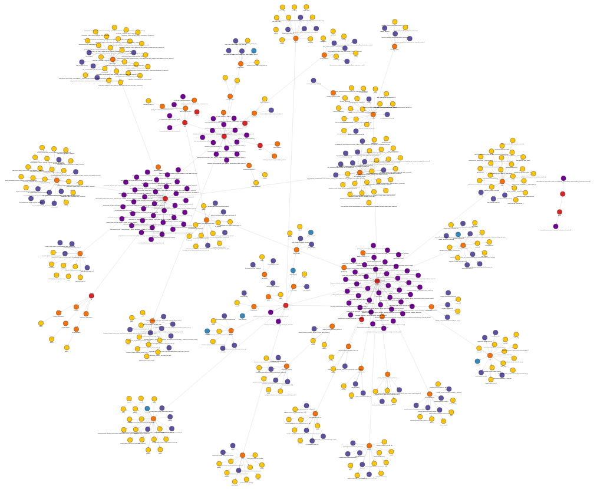

# Introduction

cpp-graph is a program that parses C++ code using
[libclang](https://clang.llvm.org/doxygen/group__CINDEX.html) to
create a graph representation of the parsed code with
[memgraph](https://memgraph.com/).

The memgraph graph schema is shown below:

# Building

Building cpp-graph is best done with the
[cpp-graph-project](https://github.com/goodfella/cpp-graph-project)
repository since it brings in the necessary dependencies and contains
a top level CMakeLists.txt that contains the required additional build
directives.

# Examples
## Call graph:

## Code organization

